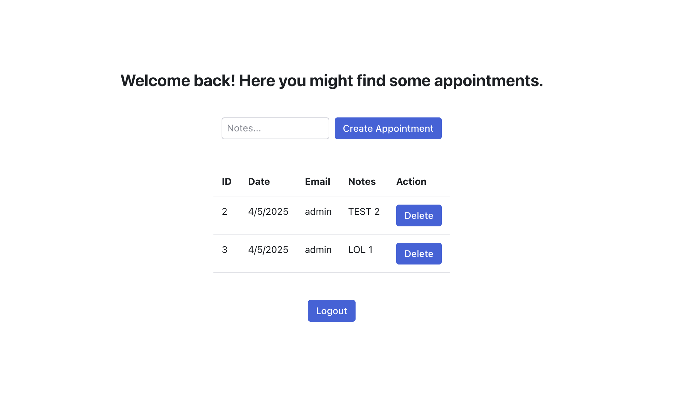

# Test task for CloudLinux

Example of Django DRF CRUD API + React.js Frontend App

## Brief description of the idea

That's the app that collects appointments from users (e.g., doctor appointments).
A user can create an appointment and then leave responses inside.
An administrator can view all appointments and also leave responses inside.

## How to run this project

`docker compose up --build`

Then the API can be found at http://localhost:8000,
and the frontend app can be found at http://localhost:3000

P.S. sorry for the delay and possible unfinished things :)